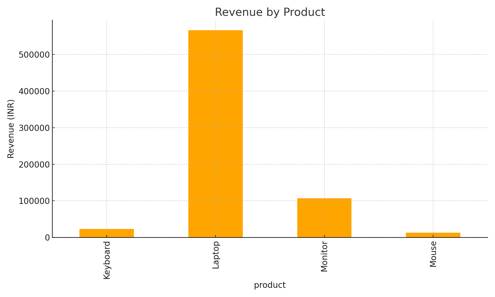

# Task 7 - Basic Sales Summary using SQLite and Python
Python + SQLite project to analyze and visualize sales data with bar charts

## Objective
Extract and visualize basic sales data (like total quantity and revenue) from a SQLite database using Python.

## Tools Used
- Python
- SQLite (via `sqlite3`)
- Pandas
- Matplotlib

## Files Included
- `Task_7_Sales_Summary.ipynb` – Main notebook with code
- `sales_data.db` – SQLite database file
- `sales_chart.png` – Bar chart showing product-wise revenue
- `sales_summary.csv` – Sales summary data in tabular format

## Output Example

| Product   | Total Quantity | Revenue (INR) |
|-----------|----------------|----------------|
| Keyboard  | 30             | 46000.0        |
| Laptop    | 16             | 1132000.0      |
| Monitor   | 18             | 214000.0       |
| Mouse     | 50             | 26000.0        |

## Skills Practiced
- Writing SQL queries using SQLite
- Connecting SQL with Python
- Performing data aggregation and visualization
